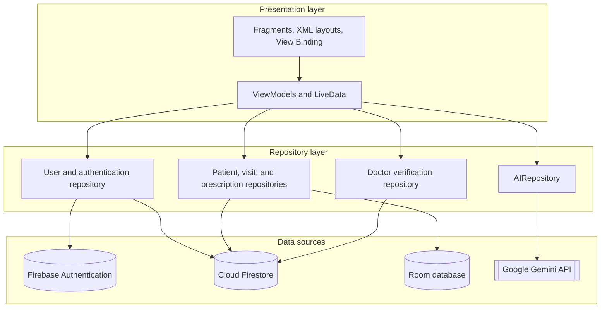
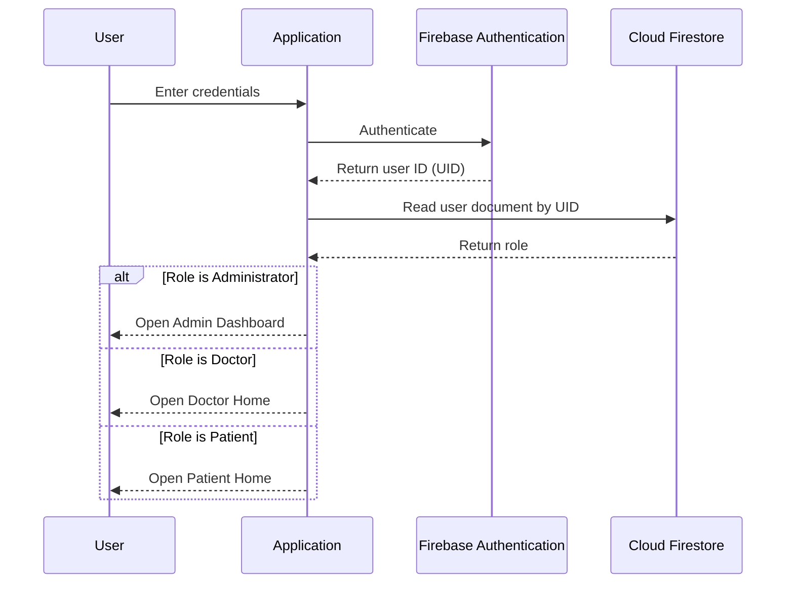
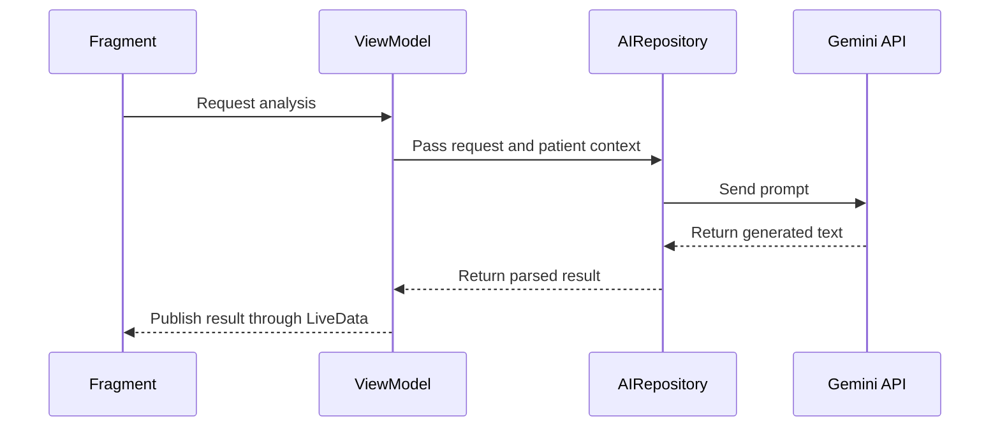
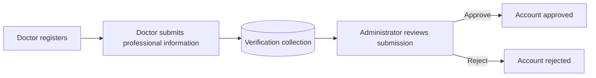

# MediSync Technical Guide

**MediSync** is a native Android application for managing healthcare workflows. It provides separate, role-based experiences for patients, doctors, and administrators, and it uses generative AI to give patients health insights.

This document describes what MediSync does, how it is built, and how to set it up, run it, and extend it.

| | |
|---|---|
| **Document type** | Technical overview, setup guide, and reference |
| **Platform** | Android |
| **Language** | Kotlin (with XML layouts) |
| **Architecture** | MVVM with the Repository pattern |
| **Backend services** | Firebase Authentication, Cloud Firestore |
| **AI service** | Google Gemini |

---

## Contents

1. [About this document](#1-about-this-document)
2. [Product overview](#2-product-overview)
3. [Architecture](#3-architecture)
4. [Authentication and role-based routing](#4-authentication-and-role-based-routing)
5. [Data management](#5-data-management)
6. [AI module](#6-ai-module)
7. [Doctor verification](#7-doctor-verification)
8. [Set up and run the application](#8-set-up-and-run-the-application)
9. [Extend the application](#9-extend-the-application)
10. [Troubleshooting](#10-troubleshooting)
11. [Security and privacy considerations](#11-security-and-privacy-considerations)
12. [Limitations and planned work](#12-limitations-and-planned-work)
13. [Glossary](#13-glossary)

---

## 1. About this document

### Audience

This document is for:

- **Android developers** who want to build, run, or extend MediSync.
- **Technical reviewers** who want to understand the system design.

### Prerequisites

To use this document, you should be familiar with:

- Kotlin and Android application development
- The Model-View-ViewModel (MVVM) pattern
- Basic Firebase concepts (projects, Authentication, Firestore)

### Conventions

| Convention | Meaning |
|---|---|
| `Monospace` | Class names, file names, commands, and values |
| **Bold** | Interface elements and key terms on first use |
| `> [!NOTE]` | Additional information |
| `> [!IMPORTANT]` | Information required for success |
| `> [!WARNING]` | Risk of data loss, security exposure, or failure |

Procedures use numbered steps. Each procedure states its goal and, where relevant, how to verify the result.

---

## 2. Product overview

### What MediSync does

MediSync centralizes patient health records and clinical workflows in one mobile application. After sign-in, each user sees only the features that belong to their role.

### User roles and capabilities

| Role | Capabilities |
|---|---|
| **Patient** | Manage a health profile. View medical history, visits, and prescriptions. Track upcoming follow-ups. Use AI-powered health features. |
| **Doctor** | Manage patient information. Add medical visits and prescriptions. Access patient records. Submit professional credentials for verification. |
| **Administrator** | Review submitted doctor credentials. Approve or reject doctor accounts. Manage platform-level settings. |

### AI-powered features

| Feature | Description |
|---|---|
| Clinical AI Assistant | Answers healthcare questions in a conversational interface. |
| Health-risk analysis | Assesses potential health risks from patient information. |
| Health-score generation | Produces a summary score of a patient's health status. |
| Personalized health suggestions | Recommends actions based on the patient's data. |

> [!IMPORTANT]
> AI-generated content is for informational purposes only. It is not a substitute for professional medical advice, diagnosis, or treatment.

### Technology stack

| Layer | Technology |
|---|---|
| User interface | Android Fragments, XML layouts, View Binding |
| Navigation | Navigation Component |
| State management | ViewModel, LiveData |
| Asynchronous processing | Kotlin Coroutines |
| Authentication | Firebase Authentication |
| Cloud database | Cloud Firestore |
| Local database | Room |
| Generative AI | Google Gemini |

---

## 3. Architecture

MediSync uses the **MVVM** architecture with the **Repository pattern**. This separates user interface code from business logic, data access, and AI services, so you can change one layer without rewriting the others.

### Layers



### Component responsibilities

| Component | Responsibility | Must not |
|---|---|---|
| **Fragment** | Displays data, captures user input, observes `LiveData`. | Access Firestore, Room, or the AI service directly. |
| **ViewModel** | Holds UI state, runs application logic, starts coroutines. | Hold references to views or the Android `Context`. |
| **Repository** | Provides a single access point for a data type. Chooses between remote, local, and AI sources. | Contain UI logic. |
| **Data source** | Performs the actual read, write, or API call. | Be called by anything other than a repository. |

### Data flow

Data moves through the layers in one direction. Results return to the interface through observable state.

```
Fragment → ViewModel → Repository → Data source
    ▲                                    │
    └────────── LiveData ◄───────────────┘
```

1. The user acts in a **Fragment**.
2. The Fragment calls a **ViewModel** method.
3. The ViewModel launches a **coroutine** and calls a **Repository**.
4. The Repository reads from or writes to a **data source**.
5. The ViewModel publishes the result through **LiveData**.
6. The Fragment observes the `LiveData` and updates the screen.

> [!NOTE]
> Coroutines keep database, network, and AI calls off the main thread, which prevents the interface from freezing during long operations.

---

## 4. Authentication and role-based routing

MediSync authenticates users with Firebase Authentication. After a successful sign-in, the application reads the user's role from Firestore and opens the matching dashboard.



### Role-to-destination mapping

| Role | Destination |
|---|---|
| Administrator | Admin Dashboard |
| Doctor | Doctor Home |
| Patient | Patient Home |

### User identifiers

Firebase assigns each user a unique **UID**. MediSync uses the UID to associate profiles, visits, and prescriptions with the correct user.

> [!WARNING]
> Role-based routing controls which screens appear in the application. It does not protect data on its own. Enforce access control on the server by using Firestore Security Rules. See [Security and privacy considerations](#11-security-and-privacy-considerations).

---

## 5. Data management

### Cloud Firestore

Cloud Firestore is the primary data store.

| Entity | Purpose | Linked by |
|---|---|---|
| Users | Account information and role | UID |
| Patient profiles | Health profile of each patient | Patient UID |
| Visits | Medical visits recorded by doctors | Patient UID |
| Prescriptions | Prescriptions issued to patients | Patient UID |
| Doctor verification | Submitted credentials and approval status | Doctor UID |

### Room database

Room stores data locally on the device. Use it for data that the application must read without a network connection. This supports offline-oriented behavior and reduces repeated network requests.

### Choosing a data source

| Requirement | Use |
|---|---|
| Data shared across devices or users | Cloud Firestore |
| Data needed when offline | Room |
| User identity and sessions | Firebase Authentication |
| Generated insights | Google Gemini through `AIRepository` |

---

## 6. AI module

The AI module integrates Google Gemini through a dedicated class, `AIRepository`. The user interface never calls the AI service directly.



### Supported operations

| Operation | Input | Output |
|---|---|---|
| Clinical AI Assistant | User question | Conversational answer |
| Health-risk analysis | Patient health information | Risk assessment |
| Health-score generation | Patient health information | Health score |
| Personalized suggestions | Patient health information | Recommended actions |

### Why the AI layer is isolated

- **Maintainability.** Prompts, model settings, and response parsing exist in one place.
- **Replaceability.** You can change the model or provider by modifying only `AIRepository`.
- **Extensibility.** You can add capabilities without changing existing screens.

### Planned AI capabilities

- Medical report analysis
- OCR-based report extraction
- AI-assisted report summarization

---

## 7. Doctor verification

Doctor accounts require administrator approval. Verification data is stored in a separate Firestore collection, which keeps credential information apart from general user data.



### Workflow steps

1. A doctor creates an account and submits professional information.
2. The application stores the submission in the verification collection.
3. An administrator opens the **Admin Dashboard** and reviews the submission.
4. The administrator approves or rejects the account.
5. The application updates the verification status for that doctor.

---

## 8. Set up and run the application

### Before you begin

Make sure you have:

- Android Studio (current stable release)
- A JDK version supported by your Android Gradle Plugin
- An Android device or emulator
- A Google account with access to the [Firebase console](https://console.firebase.google.com/)
- A Google Gemini API key

### Task 1: Clone the repository

1. Open a terminal.
2. Run the following commands:

   ```bash
   git clone https://github.com/muhammadsahil1304/MediSync.git
   cd MediSync
   ```

### Task 2: Configure Firebase

**Goal:** Connect the application to your own Firebase project.

1. In the Firebase console, create a project.
2. Add an Android app to the project. Enter the application ID defined in `app/build.gradle`.
3. Download `google-services.json`.
4. Copy `google-services.json` into the `app/` directory.
5. In the Firebase console, open **Authentication**, and enable the **Email/Password** sign-in method.
6. Open **Firestore Database**, and create a database.

> [!WARNING]
> Do not commit `google-services.json` to a public repository unless you understand the exposure. Add it to `.gitignore` if the project is public.

### Task 3: Configure the Gemini API key

**Goal:** Allow `AIRepository` to call the Gemini API.

1. Open `local.properties` in the project root. Create the file if it does not exist.
2. Add the following line:

   ```properties
   GEMINI_API_KEY=<your-api-key>
   ```

3. Make the key available to the application through `BuildConfig` in your module-level Gradle file.

> [!IMPORTANT]
> `local.properties` is excluded from version control by default. Never place API keys in source files.

### Task 4: Build and run

1. Open the project in Android Studio.
2. Wait for Gradle sync to finish.
3. Select a device or emulator.
4. Click **Run**.

**Verify the result:** The login screen appears. Create a test account, and confirm that the application opens the dashboard for the role you selected.

### Create an administrator account

The role is stored in the user's Firestore document. To create an administrator:

1. Register a normal account in the application.
2. In the Firestore console, open the user's document in the users collection.
3. Set the role field to the administrator value used by the application.
4. Sign out and sign in again.

---

## 9. Extend the application

To add a feature, follow the existing layer boundaries. The following procedure adds a new AI capability, such as report summarization.

### Task: Add an AI capability

**Goal:** Expose a new AI operation to a screen without breaking layer separation.

1. **Add a method to `AIRepository`.** Build the prompt, call Gemini, and return a parsed result.
2. **Add a method to the relevant ViewModel.** Launch a coroutine, call the repository, and post the result to `LiveData`.
3. **Observe the `LiveData` in the Fragment.** Update the interface when the result arrives.
4. **Handle failures.** Return an error state from the repository, and display a message in the Fragment.

### Illustrative pattern

The following example shows the pattern. Names are illustrative and do not match the source exactly.

```kotlin
// Repository: owns the AI call
class AIRepository {
    suspend fun summarizeReport(text: String): Result<String> {
        // Build the prompt, call the Gemini API, and parse the response.
    }
}

// ViewModel: owns UI state
class ReportViewModel(private val aiRepository: AIRepository) : ViewModel() {
    private val _summary = MutableLiveData<Result<String>>()
    val summary: LiveData<Result<String>> = _summary

    fun summarize(text: String) {
        viewModelScope.launch {
            _summary.value = aiRepository.summarizeReport(text)
        }
    }
}

// Fragment: observes state
viewModel.summary.observe(viewLifecycleOwner) { result ->
    // Update the interface.
}
```

### Guidelines

- Keep AI logic in `AIRepository` only.
- Never access Firestore or Room from a Fragment.
- Expose state to the interface through `LiveData`.

---

## 10. Troubleshooting

| Symptom | Probable cause | Resolution |
|---|---|---|
| Build fails with a missing Google services file error | `google-services.json` is missing or in the wrong directory. | Place the file in `app/`, and sync Gradle. |
| Sign-in fails for every account | Email/Password provider is not enabled. | Enable it under **Authentication** in the Firebase console. |
| Firestore operations fail with a permission error | Security rules deny the request. | Review and update your Firestore Security Rules. |
| AI features return an error or empty result | Gemini API key is missing, invalid, or restricted. | Check `GEMINI_API_KEY` in `local.properties`, and rebuild the project. |
| User opens the wrong dashboard | The role field in the user's document is incorrect. | Correct the role value in Firestore, and sign in again. |
| Doctor cannot access doctor features | The account is not yet approved. | Have an administrator approve the account. |

---

## 11. Security and privacy considerations

MediSync handles health-related data, which is sensitive. Review the following before any real-world use.

| Area | Recommendation |
|---|---|
| **Access control** | Write Firestore Security Rules so that users can read and write only the records they are permitted to access. Do not rely on client-side routing. |
| **Secrets** | Keep API keys out of source control. Restrict keys in their provider consoles. |
| **AI data sharing** | Patient data sent to the Gemini API leaves the device. Share the minimum data required. |
| **Regulatory compliance** | Health data is subject to regulations such as HIPAA or GDPR, depending on region. Assess compliance requirements before processing real patient data. |
| **Medical reliability** | Present AI output as informational. Do not use it for clinical decisions. |

> [!WARNING]
> This project is intended for learning and demonstration. Do not use it with real patient data without a full security and compliance review.

---

## 12. Limitations and planned work

### Current limitations

- AI output depends on the model and the quality of the supplied data, and it can be incorrect.
- Offline support is partial. Only data stored in Room is available without a network connection.
- Access control must be completed in Firestore Security Rules for production use.

### Planned work

- Medical report analysis
- OCR-based report extraction
- AI-assisted report summarization
- Expanded offline synchronization between Room and Firestore
- Automated tests for ViewModels and repositories

---

## 13. Glossary

| Term | Definition |
|---|---|
| **AIRepository** | The class that isolates all communication with the Gemini API. |
| **Cloud Firestore** | A cloud NoSQL document database from Firebase. |
| **Coroutine** | A Kotlin construct for asynchronous work that does not block the calling thread. |
| **Fragment** | An Android component that represents a portion of the user interface. |
| **Firebase Authentication** | A service that verifies user identity. |
| **LiveData** | An observable data holder that is aware of the Android lifecycle. |
| **MVVM** | Model-View-ViewModel, an architecture that separates interface, state, and data. |
| **Navigation Component** | An Android library for managing screen navigation. |
| **Repository pattern** | A design pattern that hides data-source details behind a single interface. |
| **Room** | An Android library for local SQLite database access. |
| **UID** | The unique identifier that Firebase assigns to each user. |
| **View Binding** | A feature that generates type-safe references to layout views. |

---

## License

Specify your license here, for example MIT. Add a `LICENSE` file to the repository root.

## Contact

Maintained by `Mohammad Sahil`. Contact: `muhammadsahil1304@gmail.com`.
