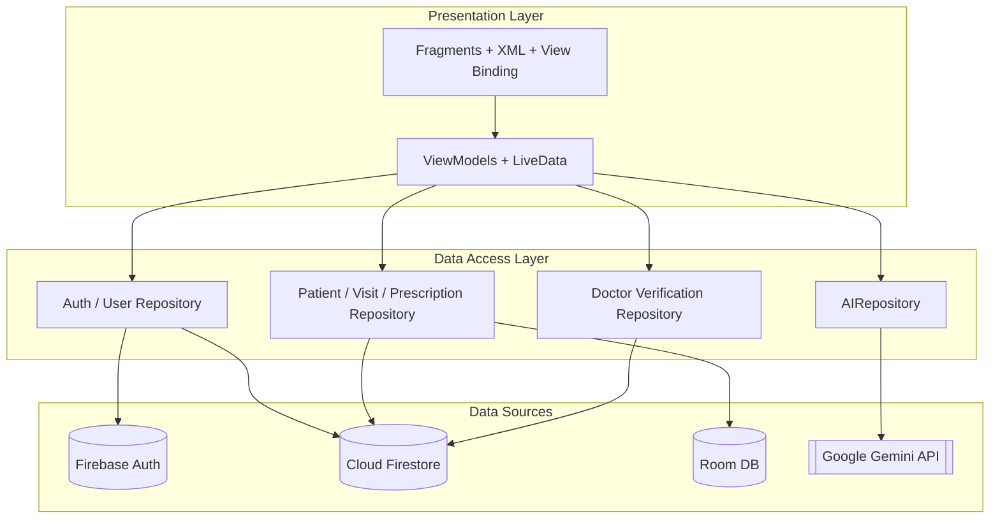
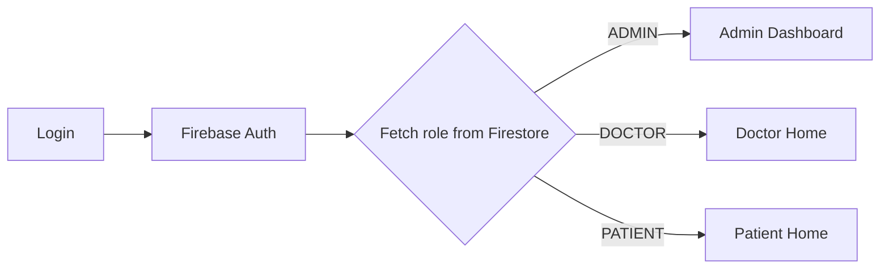
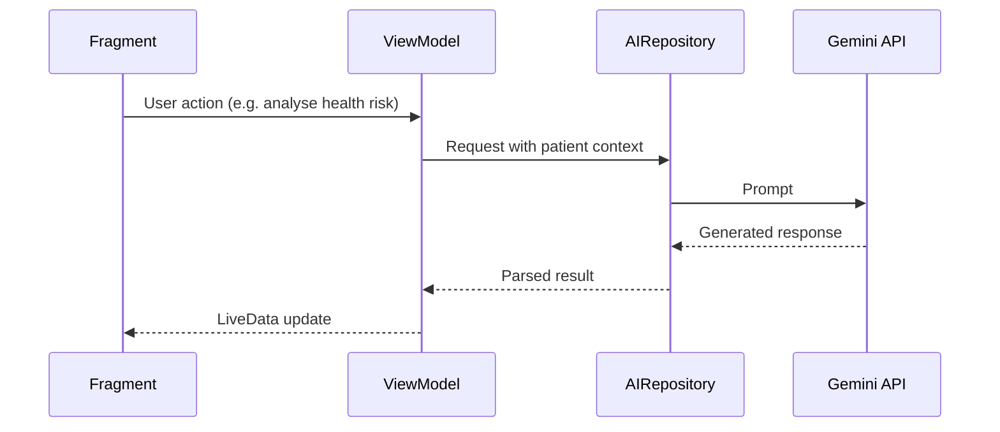
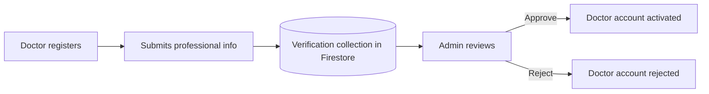

# 🏥 MediSync

**A role-based, AI-powered healthcare management platform for Android.**

## Table of Contents

1. [Overview](#1-overview)
2. [Key Features](#2-key-features)
3. [Technology Stack](#3-technology-stack)
4. [System Architecture](#4-system-architecture)
5. [Authentication & Role-Based Access](#5-authentication--role-based-access)
6. [Data Layer](#6-data-layer)
7. [AI Module](#7-ai-module)
8. [Doctor Verification Workflow](#8-doctor-verification-workflow)
9. [Project Structure](#9-project-structure)
10. [Getting Started](#10-getting-started)
11. [Design Principles](#11-design-principles)
12. [Roadmap](#12-roadmap)
13. [Contributing](#13-contributing)
14. [License](#14-license)

---

## 1. Overview

MediSync is a native Android healthcare management application built with **Kotlin** and **XML layouts**. It provides three separate workflows — for **patients**, **doctors**, and **administrators** — each with its own authentication-driven navigation and dashboard.

- **Patients** manage their health profile, review medical history, visits, prescriptions and upcoming follow-ups, and use AI-powered health features.
- **Doctors** manage patient information, record medical visits and prescriptions, and access patient records.
- **Administrators** handle platform-level management, primarily the verification of doctor accounts.

The project is built on **MVVM** combined with the **Repository Pattern**, uses **Firebase** for authentication and cloud storage, **Room** for local persistence, and integrates **Google Gemini** generative AI through a dedicated, isolated AI repository.

---

## 2. Key Features

### 👤 Patient
- Create and manage a personal health profile
- View medical history, past visits and prescriptions
- Track upcoming follow-ups
- Clinical AI Assistant, health-risk analysis, health-score generation and personalized health suggestions

### 🩺 Doctor
- Manage patient information
- Add medical visits and prescriptions
- Access patient records
- Submit professional credentials for admin verification

### 🛡️ Administrator
- Review submitted doctor credentials
- Approve or reject doctor accounts
- Oversee platform-level management

### 🤖 AI-Powered (Gemini)
- Clinical AI Assistant
- Health-risk analysis
- Health-score generation
- Personalized health suggestions

---

## 3. Technology Stack

| Layer | Technology |
|---|---|
| Language | Kotlin |
| UI | Android Fragments, XML layouts, View Binding |
| Navigation | Navigation Component |
| Architecture | MVVM + Repository Pattern |
| Reactive state | LiveData |
| Concurrency | Kotlin Coroutines |
| Authentication | Firebase Authentication |
| Cloud database | Cloud Firestore |
| Local database | Room |
| Generative AI | Google Gemini (via `AIRepository`) |

---

## 4. System Architecture

MediSync separates presentation, business logic, data access and AI services so each can evolve independently.

### 4.1 Layered Overview



### 4.2 Data Flow

```
Fragment  →  ViewModel  →  Repository  →  Data Source
   ▲                                            │
   └──────────── LiveData (UI state) ◄──────────┘
```

1. A **Fragment** captures user interaction and observes `LiveData` exposed by its ViewModel.
2. The **ViewModel** holds UI state and application logic, launching **coroutines** for asynchronous work so the main thread is never blocked.
3. The **Repository** abstracts where data comes from (Firestore, Room, or Gemini) and exposes a clean API to the ViewModel.
4. The **Data Source** performs the actual I/O (network, database, or AI call).

### 4.3 Responsibilities

| Component | Responsibility |
|---|---|
| **Fragment / XML / View Binding** | Render UI, handle user input, observe state. Contains no data-access logic. |
| **ViewModel** | Manage UI state, orchestrate use cases, survive configuration changes. |
| **Repository** | Single source of truth; mediates between remote, local and AI sources. |
| **Firestore / Room / Gemini** | Persistent cloud data, local/offline data, and generative AI respectively. |

---

## 5. Authentication & Role-Based Access

Authentication uses **Firebase Authentication**. After sign-in, the app retrieves the user's **role** from Firestore and routes them to the appropriate dashboard.



- Each user is identified by a unique **Firebase UID**.
- The UID is the key that associates medical records (profiles, visits, prescriptions) with the correct user.
- Navigation is handled by the **Navigation Component**, with role-specific flows so each user type only reaches screens relevant to them.

> **Security note:** Client-side routing is a UX measure, not a security boundary. Access to data must also be enforced with **Firestore Security Rules** (see [Roadmap](#12-roadmap)).

---

## 6. Data Layer

### 6.1 Cloud Firestore (primary store)

Firestore stores the platform's core entities:

| Entity | Description |
|---|---|
| `users` | Account data and the user's role |
| `patient profiles` | Health profile for each patient |
| `visits` | Medical visits recorded by doctors |
| `prescriptions` | Prescriptions linked to patients and visits |
| `doctor verification` | Separate collection holding submitted professional information and approval status |

Records are linked through Firebase UIDs.

### 6.2 Room (local persistence)

Room provides local storage where required, supporting **offline-oriented** behavior and reducing dependence on network availability for frequently accessed data.

### 6.3 Concurrency

All repository operations are exposed through **Kotlin Coroutines**, keeping Firestore, Room and AI calls off the main thread. Results are delivered to the UI via **LiveData**.

---

## 7. AI Module

AI functionality is powered by **Google Gemini** and is encapsulated in a dedicated **`AIRepository`**.



### Current capabilities
- **Clinical AI Assistant** — conversational healthcare assistant
- **Health-risk analysis** — risk assessment from patient data
- **Health-score generation** — summarized health indicator
- **Personalized health suggestions** — tailored lifestyle and care guidance

### Design benefits
- The UI never talks to the AI service directly; Fragment → ViewModel → `AIRepository`.
- Prompting, model configuration and response parsing live in one place.
- New AI features can be added without touching existing screens.

### Planned extensions
- Medical report analysis
- OCR-based report extraction
- AI-assisted report summarization

> ⚠️ **Disclaimer:** AI-generated output is informational only and is **not a substitute for professional medical advice, diagnosis, or treatment.**

---

## 8. Doctor Verification Workflow

Doctor accounts require approval before gaining full access.



Verification data is kept in a **separate Firestore collection**, isolating sensitive credential information from general user data.

---

## 9. Project Structure

> Adjust folder and package names to match your repository.

```
app/
└── src/main/
    ├── java/<your.package>/
    │   ├── ui/
    │   │   ├── auth/            # Login, registration
    │   │   ├── admin/           # Admin dashboard, doctor verification
    │   │   ├── doctor/          # Doctor home, visits, prescriptions
    │   │   └── patient/         # Patient home, profile, history, AI features
    │   ├── viewmodel/           # ViewModels (LiveData + coroutines)
    │   ├── repository/          # Repositories incl. AIRepository
    │   ├── data/
    │   │   ├── remote/          # Firebase Auth / Firestore
    │   │   ├── local/           # Room DAOs, entities, database
    │   │   └── model/           # Data classes
    │   └── util/
    └── res/
        ├── layout/              # XML layouts
        ├── navigation/          # Navigation graphs
        └── ...
```

---

## 10. Getting Started

### Prerequisites
- Android Studio (latest stable recommended)
- JDK 17 (or the version required by your Gradle setup)
- A Firebase project
- A Google Gemini API key

### Setup

1. **Clone the repository**
   ```bash
   git clone [https://github.com/muhammadsahil1304/MediSync.git]
   cd MediSync
   ```

2. **Configure Firebase**
   - Create a project in the [Firebase Console](https://console.firebase.google.com/).
   - Register the Android app using the project's application ID.
   - Enable **Authentication** (Email/Password) and **Cloud Firestore**.
   - Download `google-services.json` and place it in `app/`.

3. **Configure the Gemini API key**

   Add your key to `local.properties` (this file is git-ignored):
   ```properties
   GEMINI_API_KEY=your_api_key_here
   ```
   Expose it via `BuildConfig` in `app/build.gradle.kts`, and never commit it to version control.

4. **Build and run**
   - Sync Gradle, select a device or emulator, and run the `app` configuration.

### Security checklist
- [ ] `google-services.json` and `local.properties` are not committed
- [ ] Firestore Security Rules are configured before any production use
- [ ] API keys are restricted in their respective consoles

---

## 11. Design Principles

- **Separation of concerns** — presentation, business logic, data access and AI are independent layers.
- **Single source of truth** — repositories mediate all data access.
- **Reactive UI** — LiveData drives UI updates from state changes.
- **Non-blocking operations** — Coroutines keep the main thread responsive.
- **Modularity and extensibility** — new features (e.g. report OCR) can be added without heavy coupling to existing UI.
- **Role isolation** — dedicated flows for patients, doctors and administrators.

---

## 12. Roadmap

- [ ] Medical report analysis
- [ ] OCR-based report extraction
- [ ] AI-assisted report summarization
- [ ] Firestore Security Rules enforcing role-based data access
- [ ] Expanded offline support and Room ↔ Firestore sync
- [ ] Unit and instrumentation tests for ViewModels and Repositories
- [ ] Dependency injection (Hilt)
- [ ] Appointment scheduling and notifications for follow-ups

---

## 13. Contributing

Contributions are welcome.

1. Fork the repository
2. Create a feature branch: `git checkout -b feature/your-feature`
3. Commit your changes: `git commit -m "Add your feature"`
4. Push the branch: `git push origin feature/your-feature`
5. Open a Pull Request

Please follow the existing MVVM + Repository structure and keep UI, logic and data access separated.

---

## 14. License

This project is licensed under the **[MIT License](LICENSE)** — replace with your chosen license.

---

<p align="center">Built with ❤️ using Kotlin, Firebase, and Gemini.</p>
